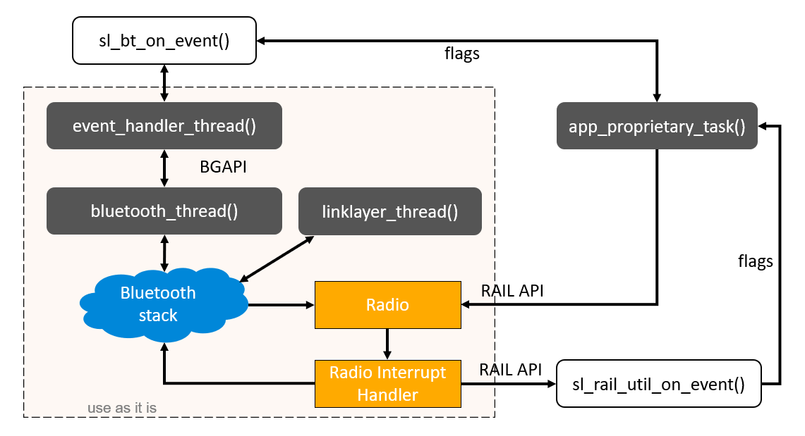
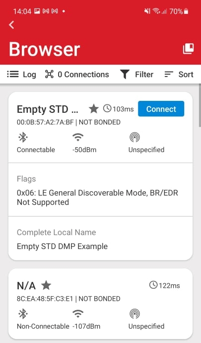

# SoC - Empty Standard DMP

This example application contains a basic implementation of a Bluetooth and proprietary dynamic multiprotocol (DMP) application. It serves as a starting point for any DMP application development.

Note: This DMP application uses a standard physical layer for the proprietary protocol, defined by the  IEEE 802.15.4 standard, which cannot be changed.

> Note: this example expects a specific Gecko Bootloader to be present on your device. For details see the Troubleshooting section.

## BGAPI Wake On RF usage

### Expected behavior

The BGAPI Wake On RF feature is disabled by default, and requires enablement from a BGAPI command. This feature allows the device to wake up from sleep mode when an RF packet is received by informing its host of such event.

By default, if the packet has a Time To Live (TTL) value > 0, the device will wake up from sleep mode and broadcast the wake packet back with a TTL decremented by 1.

It also allows for Sending wake packets

### BGAPI Wake On RF command format

The BGAPI packet format is as follows:

| Command ID | Packet Data |

* Disable command do not require any payload

  | Command ID | Packet Data |
  | ----------- | ------------- |
  | 0x02 |  |

* Enable command requires a payload with the following format:

  | Command ID | Packet Data |
  | ----------- | ------------- |
  | 0x01 | PanID (LSB first) ; Operating Channel ; Option Mask (See wake on rf options) |

* The TX command  requires a payload with the following format:

  | Command ID | Packet Data |
  | ----------- | ------------- |
  | 0x04 | Frame Counter (1 Byte) ; Option Mask (See wake on rf options) ; Time To Live (1 Byte) |

* The RX event is similar to the TX command :

  | Command ID | Packet Data |
  | ----------- | ------------- |
  | 0x03 | Frame Counter (1 Byte) ; Option Mask (See wake on rf options) ; Time To Live (1 Byte) |

### NCP Commander command examples

* Enable command
  * Pan ID = 0xABCD
  * Operating Channel = 11
  * Option Mask = 0x01 (I Am Border Router)

  `sl_bt_user_message_to_target(01CDAB0B01)`

* Disable command
  `sl_bt_user_message_to_target(02)`

* TX command
  * Frame Counter = 0x00
  * Option Mask = 0x01 (I Am Border Router)
  * TTL = 0x03

  `sl_bt_user_message_to_target(04000103)`

## Getting Started

To get started with Silicon Labs Bluetooth and Simplicity Studio, see [QSG169: Bluetooth SDK v3.x Quick Start Guide](https://www.silabs.com/documents/public/quick-start-guides/qsg169-bluetooth-sdk-v3x-quick-start-guide.pdf).

This example implements a basic project with Bluetooth Low Energy and a proprietary protocol running parallel on the device. The project is based on a Real Time Operating System (Micrium OS or FreeRTOS according to your choice). For more information about using Real Time Operating Systems with Bluetooth, see [AN1260: Integrating v3.x Silicon Labs Bluetooth Applications with Real-Time Operating Systems](https://www.silabs.com/documents/public/application-notes/an1260-integrating-v3x-bluetooth-applications-with-rtos.pdf).

For more details about the Bluetooth and proprietary DMP applications, see [AN1269: Dynamic Multiprotocol Development with Bluetooth and Proprietary Protocols on RAIL in GSDK v3.x](https://www.silabs.com/documents/public/application-notes/an1269-bluetooth-rail-dynamic-multiprotocol-gsdk-v3x.pdf) and [UG305: Dynamic Multiprotocol User’s Guide](https://www.silabs.com/documents/public/user-guides/ug305-dynamic-multiprotocol-users-guide.pdf).

## Project Setup

The principle is the same for all Bluetooth DMP (Dynamic Multi-Protocol) applications: the device is able to communicate via Bluetooth and via a secondary protocol (either a standard one, like Zigbee, or a proprietary one) at the same time, making it possible to control the DMP device with different type of devices, or the DMP device can also act as a gateway between the different protocols. The physical layer of the proprietary protocol may be a standard one (like IEEE 802.15.4) or entirely proprietary if your device provides support for it (see datasheet).

This project implements the skeleton of such a solution using Bluetooth and a proprietary protocol with a standard physical layer. Callbacks for Bluetooth and proprietary event handling are added, but not implemented (except a very basic Bluetooth functionality that starts advertising after the boot event). The developer can add any functionality.

## Project Structure

The following image shows the overview of the software Architecture of the project.

The Bluetooth stack and RAIL are running in the background, using several tasks that should not be modified by the developer. Instead, `sl_bt_on_event()` and `sl_rail_util_on_event()` should be populated with Bluetooth and proprietary event handlers. Note: `sl_rail_util_on_event()` is called from interrupt context, therefore it must implement time-critical event handlers only! Non-time-critical event handling must be implemented in the `app_proprietary_task()`. `sl_bt_on_event()` is not called from interrupt context, therefore it can implement any type of event handlers. To add additional non-event-driven functionality, create new custom tasks.

### Bluetooth Configuration

The Bluetooth stack can be configured via the Bluetooth Software Components (see the SOFTWARE COMPONENTS tab in the Project Configurator for the .slcp file).

The project also contains a basic GATT database. GATT definitions can be extended using the GATT Configurator, which can be found under Advanced Configurators in the Software Components tab of the Project Configurator.

To learn how to use the GATT Configurator, see [UG438: GATT Configurator User’s Guide for Bluetooth SDK v3.x](https://www.silabs.com/documents/public/user-guides/ug438-gatt-configurator-users-guide-sdk-v3x.pdf).

The Bluetooth task creation and the stack initialization is already implemented in the `sl_system_init` function, called from the `main` function. The Bluetooth event handler function, `sl_bt_on_event`, can be found in the file *bluetooth_app.c*. This contains a basic event handler, which can be extended according to the applications needs. The default implementation starts advertising with the device name defined in the GATT Configurator. After flashing it to the device, it will be visible in the EFR connect app, as follows:

### Proprietary Configuration

RAIL (Radio Abstraction and Integration Layer) can be configured via the RAIL Software Components.

This DMP application uses a standard physical layer for the proprietary protocol, defined by the  IEEE 802.15.4 standard, which cannot be changed. As a consequence, Radio Configurator cannot be used in this project.

`sl_rail_util_on_event()` and `app_proprietary_task()` are implemented in *app_proprietary.c*. Extend these functions to implement your proprietary event handlers.

### Application Tasks

You can implement additional application-specific tasks in *app.c*. You can create and handle any RTOS task here according to your functionality.

## Troubleshooting

### Bootloader Issues

Note that Example Projects do not include a bootloader. However, Bluetooth-based Example Projects expect a bootloader to be present on the device in order to support device firmware upgrade (DFU). To get your application to work, you should either

* flash the proper bootloader or
* remove the DFU functionality from the project.

**If you do not wish to add a bootloader**, then remove the DFU functionality by uninstalling the *Bootloader Application Interface* software component -- and all of its dependants. This will automatically put your application code to the start address of the flash, which means that a bootloader is no longer needed, but also that you will not be able to upgrade your firmware.

**If you want to add a bootloader**, then either

* Create a bootloader project, build it and flash it to your device. Note that different projects expect different bootloaders:
  * for NCP and RCP projects create a *BGAPI UART DFU* type bootloader
  * for SoC projects on Series 1 devices create a *Bluetooth in-place OTA DFU* type bootloader or any *Internal Storage* type bootloader
  * for SoC projects on Series 2 devices create a *Bluetooth Apploader OTA DFU* type bootloader

* or run a precompiled Demo on your device from the Launcher view before flashing your application. Precompiled demos flash both bootloader and application images to the device. Flashing your own application image after the demo will overwrite the demo application but leave the bootloader in place.
  * For NCP and RCP projects, flash the *Bluetooth - NCP* demo.
  * For SoC projects, flash the *Bluetooth - SoC Thermometer* demo.

**Important Notes:**

* when you flash your application image to the device, use the *.hex* or *.s37* output file. Flashing *.bin* files may overwrite (erase) the bootloader.

* On Series 1 devices (EFR32xG1x), both first stage and second stage bootloaders have to be flashed. This can be done at once by flashing the *-combined.s37* file found in the bootloader project after building the project.

* On Series 2 devices SoC example projects require a *Bluetooth Apploader OTA DFU* type bootloader by default. This bootloader needs a lot of flash space and does not fit into the regular bootloader area, hence the application start address must be shifted. This shift is automatically done by the *Apploader Support for Applications* software component, which is installed by default. If you want to use any other bootloader type, you should remove this software component in order to shift the application start address back to the end of the regular bootloader area. Note, that in this case you cannot do OTA DFU with Apploader, but you can still implement application-level OTA DFU by installing the *Application OTA DFU* software component instead of *In-place OTA DFU*.

For more information on bootloaders, see [UG103.6: Bootloader Fundamentals](https://www.silabs.com/documents/public/user-guides/ug103-06-fundamentals-bootloading.pdf) and [UG489: Silicon Labs Gecko Bootloader User's Guide for GSDK 4.0 and Higher](https://cn.silabs.com/documents/public/user-guides/ug489-gecko-bootloader-user-guide-gsdk-4.pdf).

### Programming the Radio Board

Before programming the radio board mounted on the mainboard, make sure the power supply switch is in the AEM position (right side) as shown below.

## Resources

[Bluetooth Documentation](https://docs.silabs.com/bluetooth/latest/)

[UG103.14: Bluetooth LE Fundamentals](https://www.silabs.com/documents/public/user-guides/ug103-14-fundamentals-ble.pdf)

[QSG169: Bluetooth SDK v3.x Quick Start Guide](https://www.silabs.com/documents/public/quick-start-guides/qsg169-bluetooth-sdk-v3x-quick-start-guide.pdf)

[UG434: Silicon Labs Bluetooth ® C Application Developer's Guide for SDK v3.x](https://www.silabs.com/documents/public/user-guides/ug434-bluetooth-c-soc-dev-guide-sdk-v3x.pdf)

[AN1260: Integrating v3.x Silicon Labs Bluetooth Applications with Real-Time Operating Systems](https://www.silabs.com/documents/public/application-notes/an1260-integrating-v3x-bluetooth-applications-with-rtos.pdf)

[AN1269: Dynamic Multiprotocol Development with Bluetooth and Proprietary Protocols on RAIL in GSDK v3.x](https://www.silabs.com/documents/public/application-notes/an1269-bluetooth-rail-dynamic-multiprotocol-gsdk-v3x.pdf)

 [UG305: Dynamic Multiprotocol User’s Guide](https://www.silabs.com/documents/public/user-guides/ug305-dynamic-multiprotocol-users-guide.pdf)

[Bluetooth Training](https://www.silabs.com/support/training/bluetooth)

## Report Bugs & Get Support

You are always encouraged and welcome to report any issues you found to us via [Silicon Labs Community](https://www.silabs.com/community).
